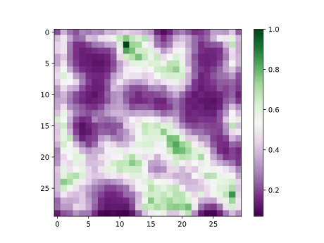

# COVID Abstract Similarity
A python tool using [FastText](https://fasttext.cc/) to find out similar abstracts about COVID-19.

## Models

There are currently one pre-trained FastText model.
- [Pretrained Model](https://drive.google.com/open?id=1mnZo5krIKo2YnPGDlArgSfSTY3jIQFus)


## Manual
0. The whole project is developed and tested on `Python 3.7.6`.

1. Download and install required packages (Remember to set the environment variable `FASTTEXT_DIR`)
```Shell
git clone https://github.com/facebookresearch/fastText.git
cd fastText
make
chmod 755 fasttext
export FASSTTEXT_DIR=/CURRENT/DIR

pip install chemdataextractor spacy numpy
```

2. For MongoDB users, all the useful APIs are available at `similar_abstract_mongodb.py`.

```python
from similar_abstract_mongodb import AbstractSimilarity

abstract_similarity = AbstractSimilarity(model_path="path_to_model")
# train new fastText model
abstract_similarity.train()
# clear and generate similar_abstracts for all the paper
abstract_similarity.build()
# generate the similar_abstracts for newly added papers,
# update the similar_abstract for the old ones as well
abstract_similarity.update()
```
- Note that model file should end with `.bin`.

You can also use this script from command line.
```
~ > python similar_abstract_mongodb.py -h
usage: similar_abstract_mongodb.py [-h] -m MODEL
                                   [-v {CRITICAL,ERROR,WARNING,INFO,DEBUG}]
                                   {train,build,update}

positional arguments:
  {train,build,update}  Possible modes: train, build, update.

optional arguments:
  -h, --help            show this help message and exit
  -m, --model MODEL
                        path to the fasttext model.
  -v, --verbose {CRITICAL,ERROR,WARNING,INFO,DEBUG}
                        set logger level, default=WARNING
```
Before running the routine, it is highly recommended to read the default parameters listed in the class variables of `AbstractSimilarity`.

## Results
### Self-Organizing Map
To visualize the result of models, we use the self-organizing map (SOM) to generate a distance map.

The purple areas in the picture represent certain topics of the abstract texts, while the green areas are the border of multiple topics.



### Title-Abstract Matching
To figure out whether our language model learns the language representation, we proposed a special task.

For a given title-abstract pair, we input the vectors of the title and the abstract to a neural network with 2 hidden layers (2048 neurons each layer). The task is to predict whether the title and the abstract belong to the same paper. After 5000 iterations (`batch_size=64`), the accurrancy turns out __95.16%__.